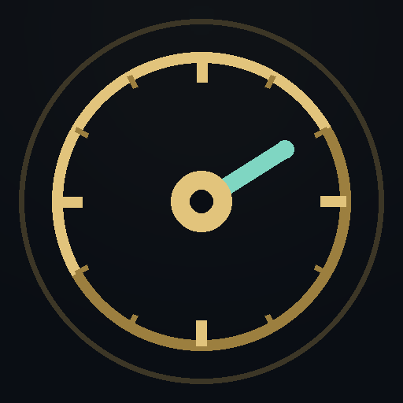
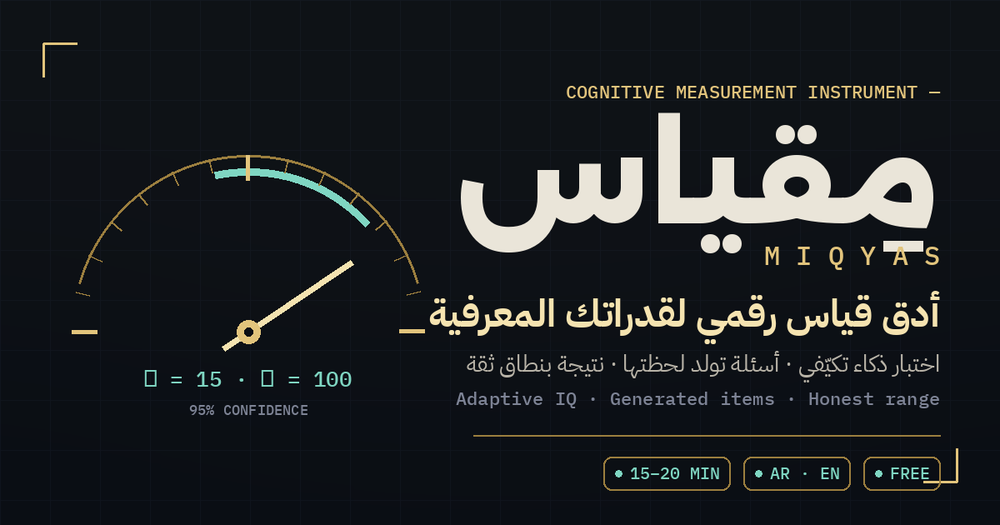

# مِقياس · MIQYAS

**أدق قياس رقمي لقدراتك المعرفية**

اختبار ذكاء مبنيّ كأداة قياس علمية — أنماط وأشكال وأرقام تقيس تفكيرك الخام،
بلا لغة تحفظها ولا معلومات تعرفها ولا ميزة لثقافة على أخرى.

 

  

    

  

 

<h2>ما هو مِقياس؟</h2>

«مِقياس» اختبار ذكاء رقمي يعامل عقلك كما تعامل أداةُ قياسٍ دقيقة أيَّ ظاهرة: يقيس، ويعطيك القراءة كما هي. لا أرقام منفوخة لإسعادك، ولا أسئلة معلومات عامة تكافئ من قرأ أكثر — فقط قدرتك الحقيقية على الاستدلال، مقاسةً بأمانة.

<h2>لماذا يختلف عن اختبارات الإنترنت؟</h2>

<table dir="rtl" align="right" width="100%">
<tr>
<td width="50%" valign="top"><h3>يتكيّف مع مستواك</h3>
لا قائمة أسئلة ثابتة: كل إجابة تختار سؤالك التالي. أصبت؟ يرتفع التحدي. أخطأت؟ يلين قليلًا. هكذا يحاصر الاختبار مستواك الحقيقي بدقة عالية وبأقل عدد ممكن من الأسئلة.
</td>
<td width="50%" valign="top"><h3>عادل لأي إنسان</h3>
لا مفردات لغوية ولا معلومات عامة ولا ثقافة محلية. أشكال وأنماط وأرقام يفهمها أي عقل — فلا تمنحك لغتك أو شهادتك ميزة، ولا تُنقصانك شيئًا.
</td>
</tr>
<tr>
<td valign="top"><h3>نتيجة صادقة، لا مجاملة</h3>
تُعرض نتيجتك كما يعرضها المختصون: درجة ضمن نطاق دقة واضح، مع ترتيبك بين الناس. القياس الحقيقي له هامش دائمًا — ونحن نعرضه بدل أن نخفيه.
</td>
<td valign="top"><h3>أسئلة تولد لحظتها</h3>
أسئلتك تُبنى في اللحظة التي تبدأ فيها. لا نسخة تُحفظ، ولا إجابات تتسرّب، ولا فائدة من «تجميع الأسئلة» — كل محاولة اختبار جديد كليًا.
</td>
</tr>
</table>

<h2>ماذا ستحصل عليه في النهاية؟</h2>

<ul>
<li><b>درجة الذكاء (IQ)</b> ضمن نطاق ثقة واضح — لأن هذا ما يفعله القياس المحترم.</li>
<li><b>ترتيبك بين الناس</b> — النسبة المئوية لمن تتقدّم عليهم، وهي المعنى الحقيقي للرقم.</li>
<li><b>ملف قدراتك</b> — أين تلمع تحديدًا: قراءة الأنماط، الاستدلال بالأرقام، التصوّر المكاني، أم الذاكرة العاملة.</li>
<li><b>شهادة أنيقة باسمك</b> — تُنشأ بضغطة زر وتُحمَّل كصورة تليق بالمشاركة.</li>
</ul>

<h2>كيف تقرأ نتيجتك؟</h2>

درجة الذكاء معناها موقعك بين البشر: <b>100 هي المنتصف تمامًا</b>، وكل <b>15 نقطة</b> خطوة كاملة فوقه أو تحته. لذلك تجد بجانب درجتك دائمًا نسبتك المئوية — «تسبق 84٪ من الناس» أوضح ألف مرة من أي رقم مجرد.

وستلاحظ أن النتيجة نطاق (مثل 108–122) وليست رقمًا واحدًا. هذا ليس ضعفًا بل علامة جودة: كل قياس في الدنيا له هامش، حتى الاختبارات الرسمية التي يجريها المختصون. الموقع الذي يعطيك رقمًا واحدًا «مضبوطًا» يجاملك — ونحن لا نجامل.

<h2>قبل أن تبدأ</h2>

<ul>
<li><b>مكان هادئ</b> — خصّص نحو 20 دقيقة متواصلة بلا مقاطعة ولا إشعارات.</li>
<li><b>ذهن مرتاح</b> — التعب والنعاس يخفضان نتيجتك فعلًا.</li>
<li><b>بلا أدوات ولا مساعدة</b> — لا آلة حاسبة، لا ورقة وقلم، عقلك وحده.</li>
<li><b>قرارك نهائي</b> — بعد تثبيت الإجابة لا رجوع للسؤال السابق، تمامًا كالاختبارات الحقيقية.</li>
</ul>

<h2>خصوصيتك</h2>

بلا حساب، بلا تسجيل، بلا أسئلة شخصية. الاسم الذي تكتبه على الشهادة يُرسم على جهازك ولا يغادر متصفحك. ما يُسهم به اختبارك — بصمت وبلا أي هوية — هو معلومة إحصائية واحدة تجعل القياس أدق للجميع بعدك. كما نستخدم إحصاءات استخدام مجهولة لفهم ما يحسِّن الموقع — دون درجتك الدقيقة ودون اسمك، أبدًا.

<h2>ثبّته كتطبيق</h2>

«مِقياس» يعمل كتطبيق كامل: افتح الموقع وسيظهر زر <b>«ثبّت»</b> أعلى الصفحة (أو من قائمة المتصفح اختر «إضافة إلى الشاشة الرئيسية»). بعدها يفتح من أيقونته الخاصة ويعمل حتى دون إنترنت.

<h2>أسئلة شائعة</h2>

<b>هل النتيجة رسمية؟</b> 
النتيجة تقدير علمي عالي الدقة مبنيّ على منهجية الاختبارات المهنية نفسها — لكنها ليست تشخيصًا طبيًا ولا وثيقة رسمية صادرة عن مختص مرخّص، ونقولها لك بوضوح داخل الموقع أيضًا.

<b>هل أستطيع إعادة الاختبار؟</b> 
نعم، متى شئت — وستواجه أسئلة جديدة كليًا. للحصول على أدق قراءة أعده وأنت مرتاح وفي ظروف هادئة.

<b>هل تؤثر لغتي أو دراستي على النتيجة؟</b> 
لا. الأسئلة كلها أشكال وأنماط وأرقام صُممت لتكون عادلة عبر اللغات والثقافات، والموقع نفسه متاح بالعربية والإنجليزية بضغطة زر.

<b>لماذا انتهى اختباري بعدد أسئلة مختلف عن صديقي؟</b> 
لأن الاختبار يتوقف تلقائيًا لحظة بلوغ الدقة المطلوبة — بعضنا يحتاج 16 سؤالًا وبعضنا 28. هذه ميزة الأداة الذكية، لا خلل.

<b>ماذا لو انقطع الوقت في سؤال؟</b> 
يُحتسب السؤال وينتقل الاختبار للتالي — الوقت جزء من القياس، كما في الاختبارات الحقيقية.

 

  

---

**جميع الحقوق محفوظة © x150ll**

مِقياس MIQYAS — قياس معرفي دقيق · صُنع بعناية

